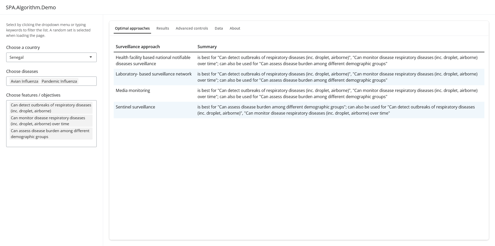

<!-- README.md is generated from README.Rmd. Please edit that file -->

# SPA.Algorithm.Demo

<!-- badges: start -->
<!-- badges: end -->

This R package reads raw data provided by experts about the adequacy of
public health surveillance in light of country context, diseases of
interest, and features and objectives of surveillance. It implements
scoring algorithms to generate a ranked list of surveillance approaches.
This is illustrated in an interactive web application.

## Installation

You can install the development version of SPA.Algorithm.Demo from
GitHub with:

``` r
# install.packages("pak")
pak::pak("stephaneghozzi/SPA.Algorithm.Demo")
```

or:

``` r
# install.packages("devtools")
devtools::install_github("stephaneghozzi/SPA.Algorithm.Demo")
```

or download this repository and run:

``` r
install.packages(path_to_this_folder, repos = NULL, type = "source")
```

## Running the app

To run the app, execute:

``` r
SPA.Algorithm.Demo::spa_algorithm_demo_app()
```

It looks like this:

<figure>

<figcaption aria-hidden="true">Screenshot of the SPA Algorithm Demo
app</figcaption>
</figure>

It is deployed here:
<https://stephaneghozzi.shinyapps.io/spa_algorithm_demo_app/>
